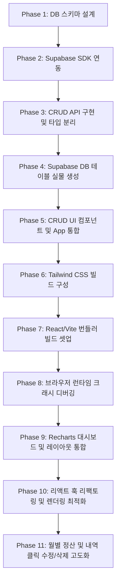

# 📝 시각화 가계부 개발 프롬프트 로그 히스토리 (PROMPT.md)

이 문서는 사용자의 요청 프롬프트 로그 및 순서에 따라 '시각화 가계부' 프로젝트의 데이터베이스 설계, 패키지 구성, 소스코드 구현, 빌드 환경 셋업, 그리고 리팩토링까지 수행된 개발 이력을 시간 순으로 정리한 개발 히스토리 문서입니다.

---

## 🛠️ 개발 히스토리 요약 (Phase-by-Phase)

---

## 🔍 단계별 상세 변경 내역

### 1단계: 데이터베이스 설계 및 타입 정의 명세
* **사용자 요구사항**: 수입/지출 데이터 종류, 자산 분류(현금/계좌/카드), 확장 가능한 세부 카테고리 구조를 포함한 테이블 설계와 TypeScript 인터페이스 정의 작성.
* **진행 작업**:
  * [schema.md](file:///c:/Users/ChoiJunguk/Desktop/groomStudy/household-accounts/docs/schema.md) 문서를 생성하여 PostgreSQL DDL SQL 및 React용 TypeScript 스펙 명세서 작성.
  * `user_id`를 활용하여 기본(공통) 카테고리와 개인(커스텀) 카테고리를 분리할 수 있는 확장형 구조 모델링.

### 2단계: Supabase 연동 코드 및 SDK 설치
* **사용자 요구사항**: Supabase SDK 패키지 설치 및 환경 변수를 사용하는 초기화 파일 구성.
* **진행 작업**:
  * `@supabase/supabase-js` 패키지 설치 진행.
  * [supabaseClient.ts](file:///c:/Users/ChoiJunguk/Desktop/groomStudy/household-accounts/src/supabaseClient.ts) 파일을 생성해 Vite와 CRA 환경 변수를 호환하여 클라이언트를 기동하는 로직 작성.

### 3단계: 가계부 API 서비스 계층 및 타입 구현
* **사용자 요구사항**: 가계부 핵심 CRUD 기능과 데이터 가공 로직 구현.
* **진행 작업**:
  * [household.ts](file:///c:/Users/ChoiJunguk/Desktop/groomStudy/household-accounts/src/types/household.ts) 파일을 생성하여 TypeScript 타입을 파일로 완벽하게 추출 및 독립시켰으며, Supabase `Database` 스키마 제네릭 타입을 보강하여 `supabaseClient.ts`에 입혔습니다.
  * [transactionService.ts](file:///c:/Users/ChoiJunguk/Desktop/groomStudy/household-accounts/src/services/transactionService.ts) 서비스를 구현해 목록 조회(외래키 JOIN 및 정렬), 추가, 수정, 삭제 기능 및 통계 분석 유틸리티 함수(`calculateStats`)를 작성했습니다.

### 4단계: Supabase 실물 데이터베이스 셋업
* **사용자 요구사항**: 사용자의 Supabase 'test' 프로젝트 DB에 테이블 생성 처리.
* **진행 작업**:
  * 브라우저 서브에이전트를 기동하여 사용자가 깃허브 로그인 세션을 승인한 후, Supabase 대시보드 내 SQL Editor에 접속.
  * 테이블 생성(`categories`, `transactions`), ENUM 타입 정의, RLS 보안 정책 활성화 및 기본 카테고리 데이터 삽입 SQL을 직접 실행해 DB 실물을 완벽히 세팅했습니다.

### 5단계: CRUD UI 개발 및 App.tsx 통합 상태 관리
* **사용자 요구사항**: 수입/지출 입력 폼, 내역 테이블 리스트, 내역 삭제 기능을 분리된 컴포넌트로 만들고 상태 관리 연동.
* **진행 작업**:
  * [TransactionForm.tsx](file:///c:/Users/ChoiJunguk/Desktop/groomStudy/household-accounts/src/components/TransactionForm.tsx): 금액 자동 천단위 콤마 포맷팅, 수입/지출 유형별 카테고리 분기 선택 기능 구현.
  * [TransactionList.tsx](file:///c:/Users/ChoiJunguk/Desktop/groomStudy/household-accounts/src/components/TransactionList.tsx): 최근 거래순 정렬 표시, 자산 배지 렌더링, 중복 차단 삭제 버튼 스피너 및 에러 바인딩.
  * [App.tsx](file:///c:/Users/ChoiJunguk/Desktop/groomStudy/household-accounts/src/App.tsx): 데이터 fetch 상태, 입력 성공 시 목록 갱신(Refetch), 삭제 연동 통합 상태 관리 기틀 마련.

### 6단계: Tailwind CSS 및 PostCSS 환경 설정
* **사용자 요구사항**: 스타일링을 위한 Tailwind CSS 구성.
* **진행 작업**:
  * `tailwindcss`, `postcss`, `autoprefixer` 설치.
  * [tailwind.config.js](file:///c:/Users/ChoiJunguk/Desktop/groomStudy/household-accounts/tailwind.config.js), [postcss.config.js](file:///c:/Users/ChoiJunguk/Desktop/groomStudy/household-accounts/postcss.config.js), [index.css](file:///c:/Users/ChoiJunguk/Desktop/groomStudy/household-accounts/src/index.css) 설정 파일 생성 및 `App.tsx` 내에 스타일을 연동시켰습니다.

### 7단계: React 및 Vite 번들러 개발 환경 보완 및 구동
* **사용자 요구사항**: 실행 상황을 웹 화면으로 확인하기 위한 로컬 실행 환경 기동.
* **진행 작업**:
  * React 패키지(`react`, `react-dom`) 및 빌드 도구(`vite`, `typescript` 등) 보완 설치.
  * [index.html](file:///c:/Users/ChoiJunguk/Desktop/groomStudy/household-accounts/index.html), [main.tsx](file:///c:/Users/ChoiJunguk/Desktop/groomStudy/household-accounts/src/main.tsx), [tsconfig.json](file:///c:/Users/ChoiJunguk/Desktop/groomStudy/household-accounts/tsconfig.json) 설정 파일을 구축하고 `package.json` 스크립트를 갱신해 `npm run dev` 로컬 서버 기동 및 브라우저 프리뷰 연동을 확인했습니다.

### 8단계: 브라우저 런타임 ReferenceError 디버깅
* **프로젝트 문제 해결**: 브라우저 렌더링 시 `process is not defined` 에러 발생 및 Supabase Key가 비어 있을 때 SDK 라이브러리 크래시로 인한 흰 화면 발생 현상 수정.
* **진행 작업**:
  * `supabaseClient.ts` 내의 환경 변수 로더를 `typeof process` 및 `typeof import.meta` 조건 체크 방어 코드로 전면 개편.
  * 환경 변수가 없을 때 크래시되지 않도록 fallback 플레이스홀더를 제공해 개발 환경 웹 렌더링을 완전히 보장했습니다.

### 9단계: Recharts 대시보드 개발 및 레이아웃 통합
* **사용자 요구사항**: 대시보드 시각화 컴포넌트(`Dashboard.tsx`) 구현 및 전체 Grid 레이아웃 조화 배치.
* **진행 작업**:
  * `recharts` 차트 라이브러리 설치.
  * [Dashboard.tsx](file:///c:/Users/ChoiJunguk/Desktop/groomStudy/household-accounts/src/components/Dashboard.tsx): 3종 요약 카드, 총 수입/지출 대조 바 차트, 현금/계좌/카드 자산 구성 비율 도넛 차트 구현.
  * `App.tsx` 레이아웃을 개편하여 상단에는 대시보드를 배치하고 하단에는 CRUD 영역을 Grid로 재배열했습니다.

### 10단계: 성능 최적화 및 렌더링 리팩토링
* **사용자 요구사항**: 예외 처리, 로딩 상태 피드백 추가 및 불필요 리렌더링 방지 최적화.
* **진행 작업**:
  * **App.tsx**: API 핸들러 콜백들을 **`useCallback`**으로 메모이징하여 하위 Props 참조 안정화. 에러 경고 피드백 박스 UI 추가.
  * **TransactionForm / TransactionList**: 컴포넌트를 **`React.memo`**로 래핑하여 무분별한 자식 리렌더링 전파 차단. 무거운 연산(`filteredCategories`)에 `useMemo` 적용. 반복 선언되는 헬퍼 함수를 글로벌 영역으로 추출.
  * **Dashboard.tsx**: 컴포넌트 마운트 상태(`isMounted`)를 추적하여 Recharts의 `ResponsiveContainer` 렌더링 타이밍을 지연, SSR/HMR 윈도우 너비 인지 크래시 버그를 원천 봉쇄했습니다.

### 11단계: 월별 정산 및 내역 클릭 수정/삭제 고도화
* **사용자 요구사항**: 
  * 1개월 단위 정산(1일~말일, 25일~익월24일, 사용자 지정) 및 월별 마크다운 결산 보고서 생성/복사 기능 구현.
  * 가계부 목록의 특정 내역을 클릭하면 좌측 폼으로 기존 데이터가 로드되어 수정 및 삭제를 진행할 수 있도록 연동.
  * .env 파일 경로 문제 디버깅 및 DB RLS 비활성화에 따른 익명 테스트 Fallback 세션 제공.
* **진행 작업**:
  * **.env 디버깅**: `VITE_SUPABASE_URL` 끝에 붙어있던 `/rest/v1/`로 인한 중복 URI 결합 404 에러를 제거하고 순수 호스트 URL로 정정.
  * **우회 세션**: RLS가 해제되어 있으나 `user_id` 외래키 constraints를 만족하기 위해, 세션이 없는 경우 사전에 생성해 둔 테스트 유저 UUID(`3198e1f1-8aee-41a2-abbe-c7e881a82a97`)를 Fallback으로 자동 설정.
  * **App.tsx 정산 필터링**: 정산 기준(`settlementRule`) 및 활성화된 월(`selectedMonth`) 상태를 정의하고 범위 내 거래 내역(`filteredTransactions`)을 산출하여 대시보드와 차트 및 목록에 일괄 반응형 연동.
  * **결산 마크다운 보고서**: 선택된 기간의 정산 결과(수입/지출 총액, 잔액, 카테고리별 비중 테이블, 상세 거래 리스트)를 마크다운 텍스트로 즉석 렌더링 및 클립보드 원클릭 복사(Copy) 기능 제공.
  * **내역 수정/삭제 폼 바인딩**: 내역 테이블 행 클릭 시 `editingTransaction` 상태로 저장하고 파란색 링 테두리로 Highlight 처리. `TransactionForm`은 `editingTransaction` 값 감지 시 '수정 완료' 모드로 분기하여 `updateTransaction` 및 `deleteTransaction` API 실행 후 리패치 연동.

